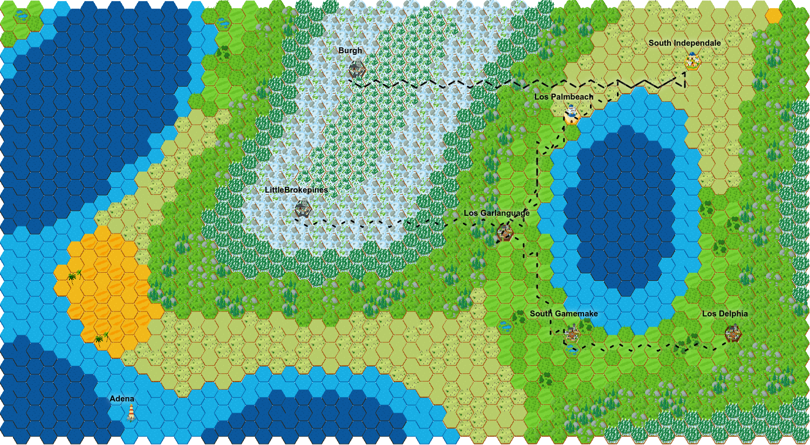

<!-- Logo Section  -->
<div align="center">
    
</div>

<!-- Project title -->
<div align="center">
    <a href="https://git.io/typing-svg"></a>
</div>

# About
JS Map Generator is a JavaScript project that aims to randomly generate a coherent map while respecting a set of constraints.

# Getting started

- Clone this repository locally
```bash
$ git clone https://github.com/alexispages/map-generator-js.git
```
- Open the **index.html** file located at the root of the project using your favorite browser
- You will see something like this:
<div align="center">
    
</div>

- Each time you press F5 key, you will have a different map generated

<p align="right"><a href="#about">back to top ⬆️</a></p>

# Fine tune maps generated

## Map size

You can tweak the map size at the end of the **index.html** file.
To do so, adjust the values passed in parameter of the *createmap* function. In the example below, 60 corresponds to the height and 30 to the width of the map.
```js
createmap(mapgrid, 60, 30)
```

## Cities names

The cities names are stored in the variable *cities_names*. They were genererated with the [Markov Namegen](https://www.samcodes.co.uk/project/markov-namegen/) tool using different *Name Data Presets*. 
```js
var cities_names = ["CityName1", "CityName2", "..."];
```

The cities names are generated within the function *create_city_paths*. A prefix before the city name is added by choosing it randomly from the *cities_prefixies* variable. You can change the content of this variable if you want to add prefixes or if you want to make it less probable to have a prefix by adding blank prefixes.
```js
var cities_prefixes= ["Prefix1", "Prefix2", "", "", "..."];
```

<p align="right"><a href="#about">back to top ⬆️</a></p>

## Biome height property

In order to ensure the consistency of the different biomes on the map, we used the [simplex-nois.js module](https://github.com/jwagner/simplex-noise.js) to generate noise in a consistent way. 

The parameters we have defined in the *Hex* class allow for small biome sizes and many variations in height (little distance between a water biome and a mountain biome).
```js
this.height = Math.round((((simplex.noise2D(x / 1000, y / 1000)) + 1) / 2) * 100);
```
Detail of the values :
- The two *1000* correspond to the **frequency**
- *2* is the **amplitude**

### Biome height

For **higher biomes**, you have to change the **amplitude** in this manner:
```js
this.height = Math.round((((simplex.noise2D(x / 1000, y / 1000)) + 1) / 0.5) * 100);
```
Putting *0.5* instead of *2* may be too extreme but you will immediately notice that the biomes height has increased considerably. There will be almost only mountains left. Conversely, if you replace the value by *5*, your biomes will only be composed of oceans.

### Biome size

For **larger biomes**, you have to change the frequency in this manner:
```js
this.height = Math.round((((simplex.noise2D(x / 4000, y / 4000)) + 1) / 2) * 100);
```
Putting *4000;4000* instead of *1000;1000* may be too extreme but you will immediately notice that the biomes size has increased considerably. 

**The two frequency values must remain close**. For example, if you use the couple of values *4000;1000*, your biomes will be stretched in a horizontal way. Conversely, if you replace the values by *1000;4000*, your biomes will be stretched in a vertical way.

<p align="right"><a href="#about">back to top ⬆️</a></p>

## Biome humidity property

The parameters we have defined in the *Hex* class allow for small forest (high humidity biome) and small desert (low himidity biome). Also, you can see variations in humidity level (a map will almost always have a desert and a forest).
```js
this.humidity = Math.round((((simplex2.noise2D(x / 2000, y / 2000)) + 1) / 2) * 100);
```
Detail of the values :
- The two *2000* correspond to the **frequency**
- *2* is the **amplitude**

### Biome humidity

For **more humid biomes**, you have to change the amplitude:
```js
this.humidity = Math.round((((simplex2.noise2D(x / 2000, y / 2000)) + 1) / 0.5) * 100);
```
Putting *0.5* instead of *2* may be too extreme but you will immediately notice that there are a lot of forests and no more deserts on the map. Conversely, if you replace the value by *10*, you will see a lot of desert and no more forests.

### Size of biomes with high or low humidity

For **larger forests or larger deserts**, you have to change the frequency:
```js
this.humidity = Math.round((((simplex2.noise2D(x / 5000, y / 5000)) + 1) / 2) * 100);
```
**The frequency values must remain close**. For example, if you use the couple of values *5000;1000*, your forests and deserts will be stretched in a horizontal way. Conversely, if you replace the values by *1000;5000*, your forests and deserts will be stretched in a vertical way.

<p align="right"><a href="#about">back to top ⬆️</a></p>

## Areas of improvement

When generating maps, you will notice that the **path finding algorithm is perfectible**. It **does not take the shortest path** from one city to another and also **can't find paths** between certain cities.

## Contributors

<a href="https://www.linkedin.com/in/alexis-pag%C3%A8s"></a>

<a href="https://www.linkedin.com/in/foulonneau/"></a>

## Acknowledgments

- [README Template](https://github.com/YousefIbrahimismail/Project-README-Template)
- [Markov Namegen Tool](https://www.samcodes.co.uk/project/markov-namegen/)
- [Simplex-noise JS module](https://github.com/jwagner/simplex-noise.js)
- [Working with simplex noise](https://cmaher.github.io/posts/working-with-simplex-noise/)

## License

- [MIT License](./LICENSE)

<p align="right"><a href="#about">back to top ⬆️</a></p>